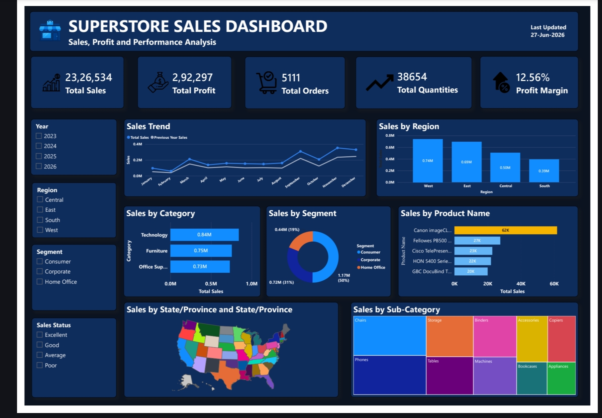

# 📊 Superstore Sales Dashboard | Power BI

## 📌 Project Overview

The Superstore Sales Dashboard is an interactive Power BI solution developed to analyze sales performance, profitability, customer segments, and product trends. The dashboard provides actionable business insights through interactive visualizations, DAX calculations, and time intelligence analysis to support data-driven decision-making.

---

## 📸 Dashboard Snapshot

---

## 🎯 Objectives

* Analyze overall sales and profit performance.
* Identify top-performing products and categories.
* Compare current and previous year sales performance.
* Monitor regional and customer segment performance.
* Track return rates and business trends.
* Support strategic business decisions through data analysis.

---

## 📂 Dataset Information

The Superstore dataset contains sales transaction data, including:

* Order ID
* Order Date
* Ship Date
* Customer Segment
* Region
* State
* Category
* Sub-Category
* Product Name
* Sales
* Profit
* Quantity
* Returns

---

## 🛠️ Tools & Technologies

* Power BI Desktop
* Power Query
* DAX (Data Analysis Expressions)
* Microsoft Excel
* Data Modeling

---

## 📈 Key Performance Indicators (KPIs)

* Total Sales
* Total Profit
* Total Orders
* Profit Margin
* Return Rate
* Sales Growth
* Previous Year Sales

---

## 📊 DAX Measures Created

* Total Sales
* Total Profit
* Total Orders
* Profit Margin
* Sales YTD
* Sales MTD
* Sales QTD
* Previous Year Sales
* Sales Growth %
* Return Rate

---

## 🧮 DAX Functions & Concepts Used

* CALCULATE()
* SUM()
* COUNTROWS()
* DIVIDE()
* IF()
* FILTER()
* ALL()
* SAMEPERIODLASTYEAR()
* DATESYTD()
* TOTALYTD()
* Time Intelligence
* Aggregation Functions
* Context Transition

---

## ⚡ Power BI Features Used

* Data Cleaning using Power Query
* Data Modeling and Relationships
* KPI Cards
* Interactive Slicers
* Cross Filtering
* Conditional Formatting
* Report Tooltips
* Drill Through Pages
* Time Intelligence Analysis
* Dynamic Visual Interactions

---

## 🚀 Dashboard Features

✅ KPI Cards

✅ Interactive Slicers

✅ Time Intelligence Analysis

✅ Tooltips & Drill Through

✅ Conditional Formatting

✅ Previous Year Comparison

✅ Dynamic Business Status Classification

✅ Cross Filtering

✅ Interactive Visualizations

---

## 📊 Visualizations

* KPI Cards
* Line Charts
* Bar Charts
* Donut Charts
* Treemap
* Filled Map
* Table Visuals
* Tooltips
* Drill Through Pages

---

## 🔍 Business Insights

* Technology category generated the highest sales contribution.
* Regional sales performance was analyzed to identify profitable areas.
* Customer segment analysis revealed major revenue contributors.
* Previous year comparisons highlighted seasonal sales trends.
* Return rates impacted profitability in specific categories.
* Business performance was evaluated using dynamic measures.

---

## 💼 Business Impact

This dashboard helps business stakeholders to:

* Monitor sales and profit performance.
* Identify high-performing products and regions.
* Analyze customer segments.
* Track business growth over time.
* Support data-driven decision-making.

---

## 📚 Skills Demonstrated

* Data Cleaning
* Data Modeling
* DAX Calculations
* Time Intelligence
* Data Visualization
* Dashboard Design
* Business Analysis
* Interactive Reporting
* Problem Solving

---

## 🏆 Project Outcome

Developed an end-to-end interactive sales analytics dashboard that enables organizations to monitor business performance, analyze sales trends, evaluate profitability, and support strategic decision-making through dynamic reporting.

---

Aspiring Data Analyst skilled in Excel, SQL, Power BI, and Data Visualization.
